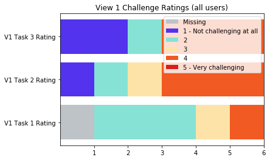

# User Research Writeup and Results
Sullivan Swift

## Discussion Guide

For the following user tests, I used this Google Form as a guide and to take notes: https://docs.google.com/forms/d/e/1FAIpQLSd85AWycdgv_f2UDgntZP8WpftjBFFSaZJrVkTkQ6rTAhnTdg/viewform

A PDF version can be found here: [W209 User Research Form - Google Forms.pdf](https://github.com/giktech/pipeline/blob/master/user%20research%20analysis/Sullivan/W209%20User%20Research%20Form%20-%20Google%20Forms.pdf)

Complete, raw results of this Google Form can be found here: [Results](https://github.com/giktech/pipeline/blob/master/user%20research%20analysis/w209_userresearch_results.csv)

Note: Not all tasks included in the form are filled in for each user. This is due to the varying timelines of our different group members and the availability of the particiants. In some cases, data included in the spreadsheet is outdated as we opted to update one of our views and its tasks before testing was completed as the change was substantial and feedback on the new view took precedence. As such, my report below will focus primarily on only one visualization in the project. Where possible, likert scale questions may contain n>2, indiciating where my groupmates were able to complete my tasks. 

## Participants

|Participant ID|Age|Gender|Race|
|---|---|---|---|
|01|25|Female|White|
|02|25|Male|White|

## Overall Interview Notes:

Users were more competent than expected in using Tableau and general explorations dashboards. Neither work with these tools such as Tableau or interactive charts on a regular basis, but both were very capable in quickly finding and picking up the machenics of the visualization. This will likely bias the results of my research against the general public since the general public will have less exposure to visualizations and will need more support in exploring the dashboard. However, the overall usecase of a dashboard like this is aimed at executives and those who will be more familiar with the operations of the company and will also likely receive training in using tools like this one. The users' abilities to work with the visualization without direction likely helped us to focus on finer details and refinement, rather than focusing on what instructions should be included for use of the tool.

### Summary of View 1, Task 1

Users were able to get pretty far on their own by just exploring the dashboard. Both users had the instinct to try to use the graphs to filter the rest of the dashboard, with one pointing out how they could confirm the filtering was occurring.  

Both users seems far more well versed in reading data visualizations and using and expecting the visualizations to provide interactions. However, neither played with the "Customer City" filter on the right handside. One noticed the Order Quarter filter and used it, but noticed that it allowed for multiple, nonconsecutive selections. 

Users both pointed out some inconsistencies in how the graphs were laid out, and lack of clarity around what units some of the charts were in. One user mentioned multiple times throughout their desire to compare the values they were looking at more easily between the graphs, but also perhaps to some baseline, such as the quarter the day they're examining is from.

### Summary of View 1, Task 2

The users completed this task easily, but they missed the use of built in sorting features on each of the bar charts to be able to easily check the most/least. 

They both missed the use of the Customer City filter along the right. I mentioned it during both tasks after answering the questions related to the third city and asked them to explore this feature with the final city. One also quickly used the search bar included in the filter, while one missed this feature as well.

One user suggested moving the filter near the "Total Orders by City" chart title. This is a great idea, however I'm not sure it can be implemented within the limitations of Tableau. There were both complaints and compliments on the setup of comparing the order number to total sales. They liked being able to visually see across, and found it pretty easy to spot discrepencies with the order of the bars, due to the colors (although some were the same, but this is due to limited color pallet and many categories - not much can be done while maintaining the overall integreity of the viz), and mentioned they would like more information in the tooltips to assist with this, both percentages and the numbers included in the other graph.

### Summary of View 1, Task 3

Users quickly used the timeline chart to select the highest point and answered the questions quickly. Both ended up using the Order Quarter filter to drill down the number of points they were looking at in the timeline chart. They both easily selected the most spiked day from this view. Again, they missed the individual chart sorting feature to view the fewest orders on a day, instead opting to scroll down the list. 

One used the selection tool (click and drag over multiple points) to select multiple points in the timeline and also explore the data surrounding the most spiked point. I found it interesting that the user did this with no prompting from my end and claimed no prior use of Tableau.

### How challenging were the tasks?

||Challenging Rating Average|
|---|---|
|View 1 Task 1 | 2.5|
|View 1 Task 2 | 2.8|
|View 1 Task 3 | 2.4|

#### Questions Incorrect v. Questions Correct
|Count of Tasks||
|---|---|
|Number Correct|34|
|Number Incorrect|13|
|Number Missing|19|

|Number of Tasks||
|---|---|
|Total number of tasks per user|11|
|Total number of tasks completed|47|

|Percent Correct/Incorrect||
|---|---|
|Percent Correct|0.72|
|Percent Incorrect|0.28 |

|Completion Rate||
|---|---|
|Task Completion Rate|0.71|

The View 1 Tasks acheived a 71% completion rate, with just over 70% of the completed tasks being answered correctly. Each user completed approximately 11 questions across the 3 tasks outlined above.

## System Usabilility Scale & Debriefing

Usability Scale Source: https://www.trymyui.com/sus-system-usability-scale
(Item 1 excluded)

Average Score: 32.75 / 45

We borrowing the System Usabilty Scale linked above to aid in assisting our analysis. The first Item on the scale didn't make sense to ask within our context and so it was removed. 

### Overall Rating

Average Overall Rating: 3.2 / 5

The results are quite polarized for the views overall (all three views of the final project considered), even though the mean is very close to a "neutral" 3. 3 out of 6 participants answered "4", equivalent to "Good".

## Priorities

### Must have

1. Consistency between all chart labeling   
    * Consistent and descriptive axis titles
    * Currency indicator for Total Sales charts
    * Align bar chart y-axis across charts
2. Clearer navigation structure  & interaction cues
    * The filters on the right were often missed in user testing, so better incorporation of what is possible with the dashboard needs to be shown. The users I had appeared very competent with working with visualizations and using interactions, which is abnormal for the general population. However, there were different results in the other interviews. The interactions were unclear and difficult
    * Will have: Additional explanation text in a short introduction would prove useful for users who are interested in using the visualization to further explore the data. Also incorporating use of the filters as examples in the insights/tutorial text and scrollytale.
3. Limit Quarter Filter to single quarter

### Should have

1. More robust tooltips that allow for quick digestion 
    * e.g., % of total sales for product category and cities

### Could have

1. A better way to display some baseline statistics for reference and comparison to the average (over all, by quarter, or by selection if more than one day is selected)
2. Edit the product category names to use proper formatting (i.e. removing the underscores)

### Won't have

1. A way to select more than one quater while filling in the missing consecutive quarters. 
    * This was too hard to implement and limiting to one quarter for a filter was intuitive, especially since the first visualization isn't for comparison between quarters. Viewing one quarter at a time allows for easier selection of a single day, or section of consecutive days, to explore.
2. City and category drop downs included near chart title.
    * Tableau wasn't capabale of acheiveing this end. Should this dashboard be recreated with D3, this would be a great feature to have. It would solve some of the "clearer navigation" issue mentioned in ### Should have (1).
3. Use unique colors for cities and product categories
    * There are just too many colors to accomodate a unique color for each category. The colors choices are left to Tableau default
4. Make certain visuals more clear, such as making the scroll bars more prominent
    * This is another limitation of Tableau. Should it be recreated in D3, this would be addressed.